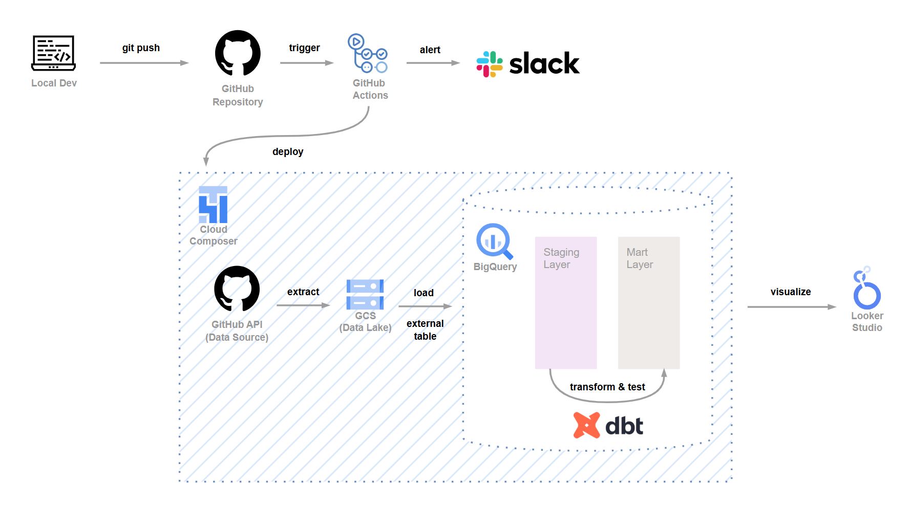
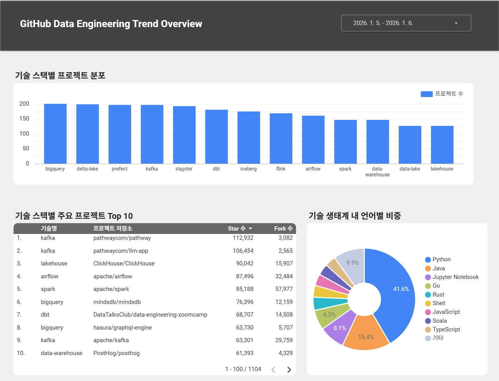
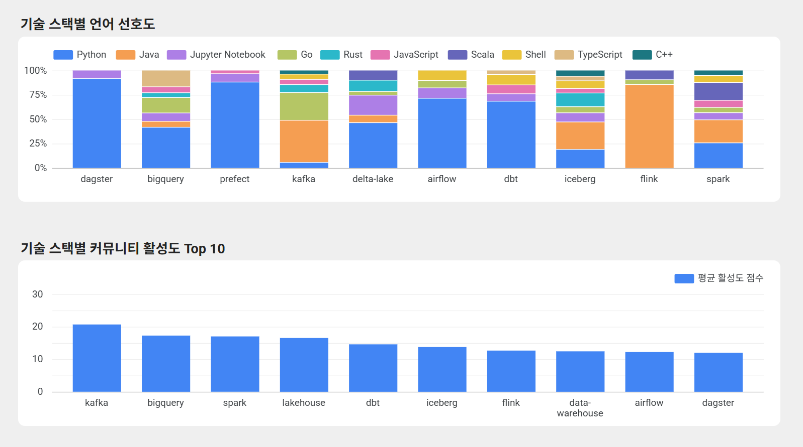
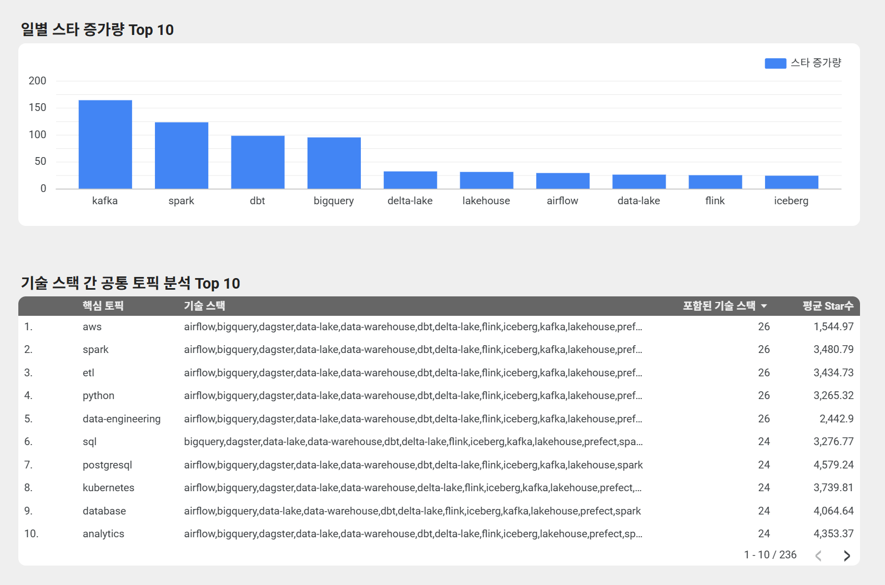

# 📊 GitHub Data Engineering Trend Pipeline
데이터 엔지니어링 주요 기술(Airflow, Spark, Kafka 등 13개)의 GitHub 데이터를 수집하여 기술별 인기도와 활성도를 분석하는 데이터 파이프라인 구축 프로젝트입니다.

## 프로젝트 기간
- 2025.12.24 ~ 2026.01.07

## 프로젝트 목표 
- 데이터 엔지니어링 주요 기술들의 **활용도, 인기도, 커뮤니티 활성도 분석**
- 장애 발생 시에도 **데이터 중복/누락 없이 재실행 가능한 파이프라인 설계**
- **dbt test + CI/CD 연동**을 통한 데이터 품질 자동 검증
- Staging / Mart 분리 기반 **계층형 DW 모델링**

## 분석 대상 기술 (13개)

`airflow`, `dagster`, `prefect`, `spark`, `flink`, `kafka`,  
`data-lake`, `data-warehouse`, `lakehouse`, `iceberg`, `delta-lake`,  
`dbt`, `bigquery`

## 시스템 아키텍처 

## 사용 기술

| 영역 | 기술 |
| --- | --- |
| Data Collection | Python, GitHub API |
| Data Lake | GCS (Parquet) |
| Data Warehouse | BigQuery |
| Transformation | dbt |
| Orchestration | Cloud Composer (Airflow) |
| CI/CD | GitHub Actions |
| Alert | Slack |
| Visualization | Looker Studio |

# 설계 포인트 

## 1. 멱등성 보장 (Idempotency)
- 날짜 단위 **Partition Overwrite 전략** 적용
- 동일 날짜 재실행 시 기존 데이터를 자동 덮어쓰기
- 장애 발생 후 별도 정리 작업 없이 즉시 복구 가능
- `gs://bucket/raw/github_repos/execution_date=YYYY-MM-DD/`

## 2. 계층형 DW 모델링 (Staging / Mart)
### Staging Layer
- Materialized : view
- ROW_NUMBER() 윈도우 함수를 사용하여 동일 날짜 내 중복 수집된 레포지토리를 정제 

### Mart Layer
- Materialized : table
- 분석 성능 최적화를 위해 최종 데이터를 물리 테이블로 저장
- execution_date 컬럼에 **Partition**을 적용하여 날짜 조건 조회 시 불필요한 데이터 스캔 방지
- keyword 컬럼에 **Clustering**을 적용하여 자주 사용하는 필터링 조건의 쿼리 성능 최적화

## 3. 데이터 품질 관리 (dbt test)
- `schema.yml` 기반 데이터 품질 테스트 정의
- CI/CD 단계에서 **dbt test 실패 시 배포 차단**

## 4. CI/CD 파이프라인
- GitHub Actions를 통해 PR 생성 시 자동으로 dbt test를 수행
- 테스트 실패 시 배포를 중단하고 Slack으로 즉시 알림 전송

## 5. 대시보드 시각화 및 인사이트 
- Python 중심 생태계 (약 40% 이상)
- Kafka / BigQuery / Spark는 프로젝트 수와 커뮤니티 활성도 모두 상위권
- 오케스트레이션 도구는 Python 의존도가 높고 처리 엔진 계열은 Scala / Java 비중 유지

